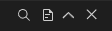

# CodeLayoutActionsRender

操作按钮组组件，这个组件用在 CodeLayout 的面板标题栏中，用于面板的额外操作，这里导出这个组件方便你使用。

## Props

| 属性 | 描述 | 类型 | 默认值 |
| :----: | :----: | :----: | :----: |
| actions | 操作项目定义 | `CodeLayoutActionButton[]` | `[]` |

## CodeLayoutActionButton

操作按钮数据定义。

| 属性 | 描述 | 类型 | 默认值 |
| :----: | :----: | :----: | :----: |
| render | 自己渲染这个按钮的全部内容，使用后下方的属性无效 | `() => VNode` | - |
| icon | 渲染按钮的图标 | `() => VNode` | - |
| text | 按钮的文字 | `string` | - |
| tooltip | 按钮的鼠标悬浮提示文字 | `string` | - |
| tooltipDirection | 按钮的鼠标悬浮提示弹出方向 | `'left'│'top'│'right'│'bottom'` | - |
| onClick | 按钮点击事件回调 | `() => void` | - |
