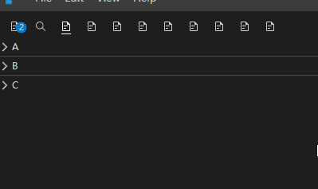

# OverflowCollapseList

自动溢出计算折叠条目组件，用在 CodeLayout 的一系列按钮组中。导出方便你使用。

## Props

| 属性 | 描述 | 类型 | 默认值 |
| :----: | :----: | :----: | :----: |
| items | 条目数据 | `any[]` | — |
| getItemSize | 计算条目大小回调（必填） | `(item: T, horizontal: boolean, index: number) => number` | - |
| activeItem | 激活条目，激活的条目不会被隐藏 | `any` | - |
| direction | 布局方向 | `'vertical'│'horizontal'` | `'horizontal'` |
| itemMenuLabel | 溢出菜单的文字创建 | `(item: any) => string` | - |
| itemCollapseMergin | 溢出计算边距 | `(item: any) => string` | `30` |
| itemKey | 用于指定唯一标识符在 item 的哪个字段 | `string` | `'name'` |
| visibleKey | 用于指定控制条目是否显示的 visible 字段在 item 的哪个字段 | `string` | `''` |

## Slots

| 插槽名 | 描述 | 参数 |
| :----: | :----: | :----: |
| item | 条目渲染插槽 | `{ visible: boolean, item: any, index: number }` |

## Events

| 事件名 | 描述 | 参数 |
| :----: | :----: | :----: |
| overflowItemClicked | 当用户点击溢出菜单条目时触发 | `item: any` |
