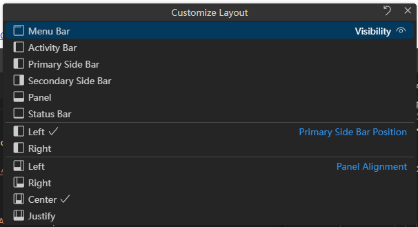

# CodeLayoutCustomizeLayout

CustomizeLayout custom layout component, located .  

Customize Layout popup window component，in the upper right corner of [CodeLayout](./CodeLayout.md) by default. The export purpose is because if you need to customize the title bar, you can control the display position yourself.

It should be used together with CodeLayout, Suggest placing it in the 'titleBarRight' slot of CodeLayout.
