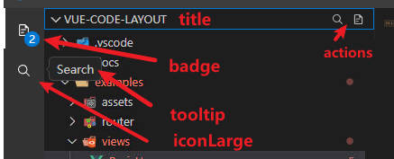
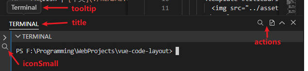
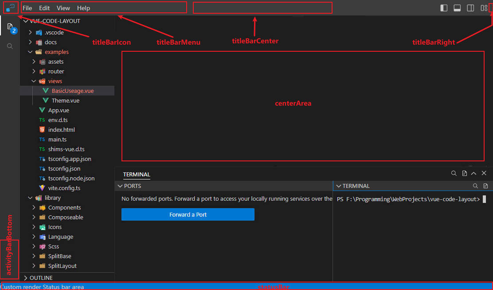

# CodeLayout使用方法

## 基础示例

推荐将 CodeLayout 置于顶级组件并设置宽高占满屏幕。

::: warning
本组件设计为占满父级容器，请为父级容器设置 `position: relative;` 样式以及一个确定的高度，否则组件将无法正确计算高度、无法正常显示。
:::

::: warning
此组件是为PC平台设计的。不适合移动设备。
:::

::: danger
此组件不支持SSR。
:::

要使用 CodeLayout ，有以下步骤：

1. 需要[导入组件](./install.md#全局导入组件).
2. 定义基础布局数据：基础布局数据控制了几个主要部分的大小、位置、是否显示等等状态。
3. 定义插槽与内容：在组件中，内容是以“面板”为单位来组织的，所以需要添加面板数据，然后在插槽中渲染。

例如，下方是一个最简单的示例：

```vue preview
<template>
  <CodeLayout 
    ref="codeLayout"
    :layout-config="config"
    :layout-data="layoutData"
    style="height: 400px"
  >
    <template #panelRender="{ panel }">
      <!--
        每个面板都会调用此插槽来渲染，你可以根据 
        panel.name 来判断当前是那个面板，渲染对应内容 
      -->
      <span>Panel {{ panel.name }}, content</span>
    </template>
  </CodeLayout>
</template>

<script lang="ts" setup>
import { ref, reactive, onMounted, nextTick, h } from 'vue';
//1. 导入组件
import { type CodeLayoutConfig, type CodeLayoutInstance, defaultCodeLayoutConfig, CodeLayoutRootGrid } from 'vue-code-layout';
import IconFile from '../../examples/assets/icons/IconFile.vue';
import IconSearch from '../../examples/assets/icons/IconSearch.vue';

//2. 定义布局的基础定义，这些数据控制了
//几个主要部分的大小、位置、是否显示等等状态
const config = reactive<CodeLayoutConfig>({
  ...defaultCodeLayoutConfig,
  primarySideBarSwitchWithActivityBar: true,
  primarySideBarPosition: 'left',
  primarySideBarWidth: 40,
  primarySideBarMinWidth: 170,
  activityBarPosition: 'side',
  secondarySideBarWidth: 20,
  secondarySideBarMinWidth: 170,
  bottomPanelHeight: 50,
  bottomPanelMinHeight: 40,
  panelAlignment: 'center',
  panelHeaderHeight: 24,
  panelMinHeight: 150,
  titleBar: true,
  titleBarShowCustomizeLayout: true,
  activityBar: true,
  primarySideBar: true,
  secondarySideBar: false,
  bottomPanel: true,
  statusBar: true,
  menuBar: true,
  bottomPanelMaximize: false
});

//定义实例和数据
const codeLayout = ref<CodeLayoutInstance>();
const layoutData = ref(new CodeLayoutRootGrid());

/**
 * 3. 向组件中添加面板数据
 */
function loadLayout() {

  //向第一侧边栏添加两个组
  const groupExplorer = codeLayout.value.addGroup({
    title: 'Explorer',
    tooltip: 'Explorer',
    name: 'explorer',
    badge: '2',
    iconLarge: () => h(IconFile),
  }, 'primarySideBar');
  codeLayout.value.addGroup({
    title: 'Search',
    tooltip: 'Search',
    name: 'search',
    tabStyle: 'single',
    iconLarge: () => h(IconSearch),
  }, 'primarySideBar');

  //获取底栏实例网格
  const bottomGroup = codeLayout.value.getRootGrid('bottomPanel');

  //向第一侧边栏刚刚添加的组中再加入面板
  groupExplorer.addPanel({
    title: 'VUE-CODE-LAYOUT',
    tooltip: 'vue-code-layout',
    name: 'explorer.file',
    noHide: true,
    startOpen: true,
    iconSmall: () => h(IconSearch),
    actions: [
      { 
        name: 'test',
        icon: () => h(IconSearch),
        onClick() {},
      },
      { 
        name: 'test2',
        icon: () => h(IconFile),
        onClick() {},
      },
    ]
  });
  groupExplorer.addPanel({
    title: 'OUTLINE',
    tooltip: 'Outline',
    name: 'explorer.outline',
    iconSmall: () => h(IconSearch),
    actions: [
      { 
        name: 'test',
        icon: () => h(IconSearch),
        onClick() {},
      },
      { 
        name: 'test2',
        icon: () => h(IconFile),
        onClick() {},
      },
    ]
  });

  //向底栏加入面板
  bottomGroup.addPanel({
    title: 'PORTS',
    tooltip: 'Ports',
    name: 'bottom.ports',
    startOpen: true,
    iconSmall: () => h(IconSearch),
  });
  bottomGroup.addPanel({
    title: 'TERMINAL',
    tooltip: 'Terminal',
    name: 'bottom.terminal',
    actions: [
      { 
        name: 'test',
        icon: () => h(IconSearch),
        onClick() {},
      },
      { 
        name: 'test2',
        icon: () => h(IconFile),
        onClick() {},
      },
    ]
  });
}

onMounted(() => {
  nextTick(() => {
    loadLayout();
  });
});

</script>

```

::: tip
将组件用于 [Electron](https://www.electronjs.org/zh/docs/latest/) 窗口中是一个不错的选择。
:::

## 面板操作

定义：

* *组*：组是一个容器，它可以包含多个子面板
* *面板*：面板，内容是以“面板”为单位来组织的，面板是最终让你渲染内容的基本单元。用户对每个面板都可以进行拖动、显示/隐藏、打开/关闭操作。

以VSCode的Explorer这个区域为例，Explorer点击它，里面还有Folders、Outline、Timeline等等，
所以边上的Explorer是一个组，里面的Folders、Outline、Timeline是面板。

你可以向组件中添加你的面板，或者获取面板实例进行对应操作或者设置。

要操作 CodeLayout 组件，需要先获取它的实例，然后调用实例上的方法：

```ts
import { type CodeLayoutInstance, CodeLayoutRootGrid } from 'vue-code-layout';

//将 codeLayoutInstance 变量通过 ref 属性绑定到 CodeLayout 组件上
const codeLayoutInstance = ref<CodeLayoutInstance>();
const layoutData = ref(new CodeLayoutRootGrid());
```

### 获取根组

如[介绍](./useage.md)所述，组件分为三个大板块，组件提供了获取根组方法：

```ts
const primarySideBar = codeLayoutInstance.value.getRootGrid('primarySideBar'); //获取第一侧边栏组
const secondarySideBar = codeLayoutInstance.value.getRootGrid('secondarySideBar'); //获取第二侧边栏组
const bottomPanel = codeLayoutInstance.value.getRootGrid('bottomPanel'); //获取底栏组

```

根布局数据中同样有这些方法：

```ts
const primarySideBar = layoutData.value.primarySideBar; //获取第一侧边栏组
const secondarySideBar = layoutData.value.secondarySideBar; //获取第二侧边栏组
const bottomPanel = layoutData.value.bottomPanel; //获取底栏组
```

### 添加组/面板

你可以向根中添加组，例如，下面的代码向第一侧边栏添加了一个标题是“Explorer”的组：

```ts
//通过实例方法添加组
const groupExplorer = codeLayout.value.addGroup({
  title: 'Explorer',
  tooltip: 'Explorer',
  name: 'explorer',
  badge: '2',
  iconLarge: () => h(IconFile),
}, 'primarySideBar');

//也可以直接向根组添加组
const groupExplorer = primarySideBar.addGroup({
  title: 'Explorer',
  tooltip: 'Explorer',
  name: 'explorer',
  badge: '2',
  iconLarge: () => h(IconFile),
});
```

获取到组后，你可以在自定义组或者根组中添加面板：

```ts
groupExplorer.addPanel({
  title: 'VUE-CODE-LAYOUT',
  tooltip: 'vue-code-layout',
  name: 'explorer.file',
  noHide: true,
  startOpen: true,
  iconSmall: () => h(IconSearch),
  actions: [
    { 
      name: 'test',
      icon: () => h(IconSearch),
      onClick() {},
    },
    { 
      name: 'test2',
      icon: () => h(IconFile),
      onClick() {},
    },
  ]
});
bottomPanel.addPanel({
  title: 'TERMINAL',
  tooltip: 'Terminal',
  name: 'bottom.terminal',
  actions: [
    { 
      name: 'test',
      icon: () => h(IconSearch),
      onClick() {},
    },
    { 
      name: 'test2',
      icon: () => h(IconFile),
      onClick() {},
    },
  ]
});
```

:::info
提示：目前 CodeLayout 不支持组中再嵌套组（VSCode 中也没有嵌套组的功能），用户拖拽时不会产生嵌套的组，因此您在使用代码添加时不要嵌套组，在非根组组中再嵌套组将不会显示。

组最多只嵌套一级（仅根组下可产生组）。
:::

### 获取面板

添加面板时 `name` 属性必须保证唯一，因此你可以使用name查询已添加的面板实例，并对其更改：

```ts
//获取面板并修改badge
const groupExplorer = layoutData.value.getPanelByName('explorer') //从布局数据中获取面板
const groupExplorer = codeLayout.value.getPanelByName('explorer') //从实例中获取面板
groupExplorer.badge = '3';
//
```

### 面板显示、隐藏

通过实例上的 `visible` 属性可以控制面板的显示、隐藏。

```ts
panel.visible = false;
panel.relayoutAfterToggleVisible();
```

::: tip
注意：当面板显示/隐藏时，需要调用 `relayoutAfterToggleVisible` 重新布局组。
:::

### 删除面板

```ts
groupExplorer.removeSelfWithShrink(); //删除自己，并触发父级组的自动收缩（自动收缩会合并空组）
```

## 标记、图标、标题、自定义操作

一个面板支持以下配置字段来控制一些信息的显示，它的显示位置如图所示：

竖向：


横向：


你可以在创建时指定这些属性，也可以在创建后通过实例属性修改。

```ts
const groupExplorer = codeLayout.value.addGroup({
  name: 'explorer',
  //标题文字
  title: 'Explorer',
  //鼠标悬浮时显示的工具提示
  tooltip: 'Explorer',
  //标记，推荐2个数字内
  badge: '2', 
  //大图标（一般在ActionBar中显示）
  iconLarge: () => h(IconFile), 
  //小图标（一般在面板头部显示）
  iconSmall: () => h(IconFile), 
  //自定义操作，自定义操作会在面板头部右侧以按钮形式显示
  actions: [
    { 
      name: 'test',
      icon: () => h(IconSearch),
      onClick() {},
    },
    { 
      name: 'test2',
      icon: () => h(IconFile),
      onClick() {},
    },
  ]
}, 'primarySideBar');
```

## 面板右键菜单 <Badge type="tip" text="^1.2.0" />

面板可以自定义用户右键点击时的菜单，通过 `CodeLayoutConfig.menuConfigs` 可以配置菜单。

* `builtinMenus` 用于控制内置菜单的显示，你可以设置为 `[]` 来隐藏所有内置菜单，或者是配置显示其中的一个或者多个。

|菜单名称|说明|
|---|---|
|toggleVisible|隐藏当前面板|
|toggleBadge|切换当前面板标记是否显示|
|otherPanelsCheck|其他面板显示/隐藏切换|
|panelPosition|主网格（侧边栏，面板）的显示位置控制|

* `customMenus` 用于自定义菜单，可设置回调，回调会传入当前面板的实例，你可以返回自定义菜单项目，显示自己的菜单，允许菜单插入指定位置（例如插入到内置菜单前面）。

```ts
const config = reactive<CodeLayoutConfig>({
  ...codeLayoutConfig,
  menuConfigs: {
    builtinMenus: [ 'toggleVisible', 'toggleBadge', 'otherPanelsCheck', 'panelPosition' ] ,
    customMenus: [
      {
        create: (panel, t, data) => {
          //在回调中返回自定义菜单。使用 vue3-context-menu 的菜单定义。
          return [
            { 
              label: `This is my menu '${panel.name}' custom item.`, 
              onClick: () => {
                console.log('menu clicked');
              }
            }
          ]
        },
        insertIndex: 0 //插入到内置菜单前面，不填写则默认插入到末尾
      }
    ]
  }
});
```

## 拖拽控制

### 面板拖拽控制

默认情况下所有面板都可以互相拖拽，可以从一个根组拖拽至另一个根组。

要对这个操作进行限制，你可以使用一下方法：

* 设置某个面板不可拖拽。

  ```ts
  bottomGroup.addPanel({
    title: 'PORTS',
    tooltip: 'Ports',
    name: 'bottom.ports',
    draggable: false, //禁止拖拽 // [!code ++]
  });
  ```

* 通过 `accept` 限制面板可以放置的根组，例如下方的面板过设置 accept 限制了面板仅可以放置在 底栏 根组。

  ```ts
  bottomGroup.addPanel({
    title: 'PORTS',
    tooltip: 'Ports',
    name: 'bottom.ports',
    startOpen: true,
    iconSmall: () => h(IconSearch),
    accept: [ 'bottomPanel' ], //限制 // [!code ++]
  });
  ```

* 通过自定义回调自由处理

    可以在基础配置中设置拖拽回调，在回调中返回false表示阻止拖拽。

    |参数名称|类型|说明|
    |-|-|-|
    |reference|CodeLayoutPanel|用户正在尝试放置位置的面板实例|
    |referencePosition|string|放置位置|
    |panel|CodeLayoutPanel|用户正在拖拽的面板实例|
    |dropTo|string|表示拖拽放置目标类型|

    ```ts
    const config = reactive<CodeLayoutConfig>({
      onDropToPanel(reference, referencePosition, panel, dropTo) {
        if (reference.name === 'explorer.file' && panel.name === 'explorer.outline') {
          return false;
        }
        return false
      },
    });
    ```

### 自定义数据拖拽控制

你可以处理拖拽到组件中的非面板数据，例如用户将一个文件拖拽进入组件的某些位置。

你可以在 `layoutConfig` 的 `onNonPanelDrag` 和 `onNonPanelDrop` 事件中处理，其中 ：

* `onNonPanelDrag` 为检查回调，用于判断是否允许用户拖拽，你可以在此回调中判断用户拖拽数据是否被允许，返回 false 将显示阻止用户拖拽状态。
* `onNonPanelDrop` 为放置回调，可以在其中中执行放置操作。同时会传入当前用户放置的面板实例和参考位置。

::: tip
组件不会阻止默认浏览器行为，例如将拖拽进入的文件打开，请在检查回调中调用 `e.preventDefault()` 来阻止浏览器的默认行为。
:::

```ts
const config = reactive<CodeLayoutConfig>({
  ...defaultCodeLayoutConfig,
  onNonPanelDrag(e, sourcePosition) {
    //如果用户拖拽进入的是文件，则进行自定义处理
    if (e.dataTransfer?.items && e.dataTransfer.items.length > 0 && e.dataTransfer.items[0].kind == 'file') {
      e.preventDefault();
      return true;
    }
    return false;
  },
  onNonPanelDrop(e, sourcePosition, reference, referencePosition) {
    //处理放置事件
    console.log('用户拖拽文件', e.dataTransfer?.files[0].name, sourcePosition, reference, referencePosition);
  },
});
```

### 拖拽提示

当内嵌自定义组件需要处理拖拽时，请在自己的拖拽处理函数中调用 `e.stopPropagation()` 来阻止事件冒泡，否则事件会冒泡至CodeLayout组件内部，使之无法处理拖拽。

```ts
//在自定义组件中处理拖拽事件
function onDragOver(e: DragEvent) {
  e.preventDefault();
  e.stopPropagation();
}
```

## 保存与加载数据

CodeLayout 支持将用户拖拽后的布局保存为 JSON 数据，并在下次进入应用时从 JSON 数据中加载恢复原布局。以下是一个基于实际项目的完整示例：

项目中提供了 `useLocalStorage` 工具类，可以方便地实现数据的自动保存与加载。

`useLocalStorage` 工具类会自动在以下时机执行操作：

* **页面加载时**：自动从本地存储加载数据
* **页面卸载前、组件卸载时**：自动将数据保存到本地存储

这种方式可以确保用户的布局修改在页面刷新或重新进入应用时不会丢失。

::: tip
提示：布局数据不会存储不可序列化的对象，例如函数、图标，并且为了国际化也不会存储标题（title）、悬浮提示（tooltip），这部分
数据需要在加载时从回调中手动设置。
:::

```vue
<template>
  <CodeLayout 
    ref="codeLayout"
    :layoutConfig="config"
    :layoutData="(layoutData as CodeLayoutRootGrid)"
    :mainMenuConfig="menuData"
  >
    <!-- 组件内容 -->
  </CodeLayout>
</template>

<script lang="ts" setup>
import { ref, reactive, onMounted } from 'vue';
import { 
  CodeLayout, 
  type CodeLayoutConfig, 
  type CodeLayoutInstance, 
  defaultCodeLayoutConfig,
  CodeLayoutRootGrid,
  useLocalStorage,
} from 'vue-code-layout';
import { h } from 'vue';
import IconFile from '@/assets/icons/IconFile.vue';
import IconSearch from '@/assets/icons/IconSearch.vue';

const codeLayout = ref<CodeLayoutInstance>();
const layoutData = ref(new CodeLayoutRootGrid());

// 配置信息
const codeLayoutConfig: CodeLayoutConfig = {
  ...defaultCodeLayoutConfig,
  titleBar: true,
  activityBar: true,
  primarySideBar: true,
  // 其他配置项
};
const config = reactive<CodeLayoutConfig>({
  ...codeLayoutConfig,
  // 其他响应式配置
});

// 保存布局配置
const { clearData: clearConfigData } = useLocalStorage(
  'CodeLayoutDemoSaveConfig',
  null,
  // 加载时的回调
  (dataObj) => {
    if (dataObj) {
      for (const key in dataObj) {
        (config as Record<string, any>)[key] = (dataObj as Record<string, any>)[key];
      }
    }
  },
  // 保存时的回调
  () => {
    return config;
  }
);

// 保存布局数据
const { clearData: clearLayoutData } = useLocalStorage(
  'CodeLayoutDemoSaveData',
  null,
  // 加载时的回调
  (data) => {
    if (data) {
      // 加载布局数据，并重新填充面板不序列化的属性
      layoutData.value.loadLayout(data, (panel) => {
        // 根据面板名称设置不同的属性
        switch (panel.name) {
          case 'explorer':
            panel.title = 'Explorer';
            panel.tooltip = 'Explorer';
            panel.badge = '2';
            panel.iconLarge = () => h(IconFile);
            break;
          case 'search':
            panel.title = 'Search';
            panel.tooltip = 'Search';
            panel.iconLarge = () => h(IconSearch);
            break;
          case 'explorer.file':
            panel.title = 'VUE-CODE-LAYOUT';
            panel.tooltip = 'vue-code-layout';
            panel.iconSmall = () => h(IconSearch);
            break;
          // 其他面板配置...
          default:
            panel.title = panel.name;
            panel.tooltip = `Panel ${panel.name}`;
            panel.iconLarge = () => h(IconSearch);
            panel.iconSmall = () => h(IconSearch);
            break;
        }
        return panel;
      });
    } else {
      // 没有保存的数据，创建新的布局
      if (codeLayout.value) {
        // 创建初始布局
        const groupExplorer = codeLayout.value.addGroup({
          title: 'Explorer',
          tooltip: 'Explorer',
          name: 'explorer',
          badge: '2',
          iconLarge: () => h(IconFile),
        }, 'primarySideBar');
        
        // 添加其他面板...
      }
    }
  },
  // 保存时的回调
  () => {
    // 只有当布局中有内容时才保存
    return layoutData.value.children.length > 0 ? layoutData.value.saveLayout() /** 序列化json */ : null;
  }
);

// 重置所有布局数据
function onResetAll() {
  layoutData.value.clearLayout();
  // useLocalStorage 内部封装了清除之后会自动重新调用加载回调
  clearConfigData();
  clearLayoutData();
}
</script>
```

你也可以使用自己的工具类来实现数据的保存与加载，例如存储数据至本地（Electron）或者存储至服务器。

## 内置主菜单

由于 CodeLayout 依赖菜单功能，所以菜单功能与CodeLayout集成，
如果你的应用需要主菜单，可以参考以下示例快速配置主菜单，也可以通过 titleBarMenu 插槽自己渲染菜单。

菜单基于 [vue3-context-menu](https://github.com/imengyu/vue3-context-menu) 组件实现，其中的配置请参考其[文档](https://docs.imengyu.top/vue3-context-menu-docs)。

```vue
<template>
  <CodeLayout 
    ref="codeLayout"
    :layoutConfig="config"
    :mainMenuConfig="menuData"
    style="height: 400px"
  >
    <template #titleBarIcon>
      
    </template>
  </CodeLayout>
</template>

<script lang="ts" setup>
import { reactive } from 'vue';
import type { MenuOptions } from '@imengyu/vue3-context-menu';
import logo from '../../examples/assets/images/logo.svg';

const config = reactive<CodeLayoutConfig>({
  primarySideBarSwitchWithActivityBar: true,
  primarySideBarPosition: 'left',
  primarySideBarWidth: 40,
  primarySideBarMinWidth: 170,
  activityBarPosition: 'side',
  secondarySideBarWidth: 20,
  secondarySideBarMinWidth: 170,
  bottomPanelHeight: 50,
  bottomPanelMinHeight: 10,
  panelAlignment: 'center',
  panelHeaderHeight: 24,
  panelMinHeight: 150,
  titleBar: true,
  titleBarShowCustomizeLayout: true,
  activityBar: true,
  primarySideBar: true,
  secondarySideBar: false,
  bottomPanel: true,
  statusBar: true,
  menuBar: true,
  bottomPanelMaximize: false
});
const menuData : MenuOptions = {
  x: 0,
  y: 0,
  items: [
    {
      label: "File",
      children: [
        { label: "New" },
        { label: "Open" },
        { 
          label: "Open recent",
          children: [
            { label: "File 1...." },
            { label: "File 2...." },
            { label: "File 3...." },
            { label: "File 4...." },
            { label: "File 5...." },
          ],
        },
        { label: "Save", divided: true },
        { label: "Save as..." },
        { label: "Close" },
        { label: "Exit" },
      ],
    },
    {
      label: "Edit",
      children: [
        { label: "Undo" },
        { label: "Redo" },
        { label: "Cut", divided: true },
        { label: "Copy" },
        { label: "Find", divided: true },
        { label: "Replace" },
      ],
    },
    {
      label: "View",
      children: [
        { label: "Zoom in" },
        { label: "Zoom out" },
        { label: "Reset zoom" },
        { label: "Full screent", divided: true },
        { label: "Find", divided: true },
        { label: "Replace" },
      ],
    },
    {
      label: "Help",
      children: [
        { label: "About" },
      ],
    },
  ],
  zIndex: 3,
  minWidth: 230,
};
</script>
```

## 其他部分自定义插槽

CodeLayout 还提供了一些插槽供您使用：



* titleBarIcon 标题栏渲染图标位置
* titleBarMenu 标题栏渲染主菜单位置
* titleBarCenter 标题栏中心位置
* titleBarRight 标题栏右侧位置（VSCode这里放置关闭按钮）
* titleBarCustomizeLayout: 自定义布局按钮位置，可用于放置自定义布局按钮或配置CodeLayoutCustomizeLayout组件
* titleBarTop 标题栏上部空间
* titleBarBottom 标题栏底部，在中心区域之上的空间，可以放置自定义操作

* activityBarTop 活动栏按钮顶部
* activityBarEnd 活动栏按钮尾部
* activityBarBottom 活动栏栏底部（VSCode这里放置设置按钮）
  * activityBar 第二活动栏开启状态下：
    * activityBarSecondaryTop
    * activityBarSecondaryEnd
    * activityBarSecondaryBottom

* tabHeaderLeftStart TAB标签模式下，左侧按钮首部，参数 `{ group }`
* tabHeaderLeftEnd TAB标签模式下，左侧按钮尾部，参数 `{ group }`
* tabHeaderRightStart TAB标签模式下，右侧额外按钮首部，参数 `{ group }`
* tabHeaderRightEnd TAB标签模式下，右侧额外按钮尾部，参数 `{ group }`

* titleBarTitle 面板大标题栏标题自定义渲染，参数 `{ group, title }`
* titleBarActionStart 面板大标题栏右侧额外按钮首部，参数 `{ group }`
* titleBarActionEnd 面板大标题栏右侧额外按钮首部，参数 `{ group }`

* centerArea 中心区域，这里可以放置SliptLayout或者其他编辑器核心组件

* statusBar 状态栏位置
  * statusBarLeft 状态栏左侧
  * statusBarRight 状态栏右侧

* emptyGroup 空组提示渲染，参数 `{ group }`

## 组件卸载提示

提示：以下两种情况，Vue可能会将你的组件卸载重新创建：

* 用户拖拽一个面板至其他面板
* 在开发模式下，当你修改了代码后，HMR重载

这时Vue可能会将你的组件卸载重新创建，组件状态会丢失，所以你需要处理自己的组件，在卸载时保存相关状态。

::: tip
**提示：** 在开发模式下，当你修改了代码后，HMR重载可能会将 CodeLayout 也卸载，如果您仅在onMounted回调中插入面板，则这时是不会重新再触发的，所以组件内面板数据会丢失，要解决这个问题，可以把原来在onMounted回调中插入面板的逻辑移至 CodeLayout 的 canLoadLayout 事件回调中，即可重新创建数据。
:::
