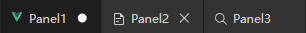
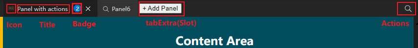

# SplitLayout使用方法

## 基础示例

推荐将 SplitLayout 置于顶级组件或者 CodeLayout 的 `centerArea` 插槽并设置宽高占满屏幕。

::: warning
本组件设计为占满父级容器，请为父级容器设置 `position: relative;` 样式以及一个确定的高度，否则组件将无法正确计算高度、无法正常显示。
:::

::: warning
此组件是为PC平台设计的。不适合移动设备。
:::

::: danger
此组件不支持SSR。
:::

要使用 SplitLayout ，有以下步骤：

1. 需要[导入组件](./install.md#全局导入组件).
2. 定义插槽与内容：在组件中，内容是以“面板”为单位来组织的，所以需要添加面板数据，然后在插槽中渲染。

例如，下方是一个最简单的示例：

```vue preview
<template>
  <div class="demo">
    <SplitLayout
      ref="splitLayoutRef"
      :layoutData="(splitLayoutData as CodeLayoutSplitNRootGrid)"
      @panelClose="onPanelClose"
    >
      <template #tabContentRender="{ panel }">
        <!--
          每个面板都会调用此插槽来渲染，你可以根据 
          panel.name 来判断当前是那个面板，渲染对应内容 
          panel.data 可以存储自定义数据
        -->
        <h2 :style="{ backgroundColor: colors[panel.data] }">Grid {{ panel.name }} {{ panel.parentGroup.direction }}</h2>
      </template>
      <template #tabEmptyContentRender="{ grid }">
        <h2>
          Empty Grid {{ grid.name }} {{ grid.direction }}
          <br><button @click="onAddPanel(grid)">+ Add Panel</button>
        </h2>
      </template>
      <template #tabHeaderExtraRender="{ grid }">
        <button @click="onAddPanel(grid)">+ Add</button>
      </template>
    </SplitLayout>
  </div>
</template>

<script lang="ts" setup>
import { ref, nextTick, h, onMounted } from 'vue';
import { type CodeLayoutSplitNInstance,
  type CodeLayoutPanelInternal, type CodeLayoutSplitNGridInternal, 
  CodeLayoutSplitNRootGrid 
} from 'vue-code-layout';

const colors = [
  '#fb0',
  '#f00',
  '#090',
  '#02a',
  '#155',
  '#f0f',
  '#0a4',
  '#cc0',
  '#f80',
  '#f08',
  '#0a8',
  '#08f',
]

//定义实例
const splitLayoutRef = ref<CodeLayoutSplitNInstance>();
//布局数据
const splitLayoutData = ref(new CodeLayoutSplitNRootGrid());

let count = 0;

//面板关闭回调
function onPanelClose(panel: CodeLayoutSplitNPanelInternal, resolve: () => void) {
  console.log('onPanelClose', panel.name);
  resolve();
}
//添加面板
function onAddPanel(grid: CodeLayoutSplitNGridInternal) {
  count++;
  grid.addPanel({
    title: `Panel${count}`,
    tooltip: `Panel${count}`,
    name: `panel${count}`,
    data: count,
  });
}

//向组件中添加面板数据
function loadLayout() {
  const grid1 = splitLayoutData.value.addGrid({
    name: 'grid1',
    visible: true,
    size: 0,
    direction: 'vertical',
  });
  const grid2 = splitLayoutData.value.addGrid({
    name: 'grid2',
    visible: true,
    size: 0,
    minSize: 100,
  });
  const grid3 = grid1.addGrid({
    name: 'grid3',
    visible: true,
    size: 0,
    minSize: 0,
  });
  grid1.addGrid({
    name: 'grid4',
    visible: true,
    size: 0,
    minSize: 100,
    canMinClose: true,
  });

  for (let i = 0; i < 2; i++) {
    count++;
    grid3.addPanel({
      title: `Panel${count}`,
      tooltip: `Panel${count} tooltip`,
      name: `panel${count}`,
      closeType: 'close',
      data: count,
    });
  }
  for (let i = 0; i < 2; i++) {
    count++;
    grid2.addPanel({
      title: `Panel${count}`,
      tooltip: `Panel${count} tooltip`,
      name: `panel${count}`,
      closeType: 'close',
      data: count,
    });
  }
  splitLayoutData.value.notifyRelayout();
}

onMounted(() => {
  loadLayout();
});
</script>


<style scoped>
h2 {
  height: 100%;
  text-align: center;
  line-height: 100px!important;
  margin: 0!important;
  color: var(--code-layout-color-text-light);
}
.demo {
  height: 400px;
  display: flex;
  flex-direction: row;
  color: var(--code-layout-color-text-light);
  background-color: var(--code-layout-color-background);
}
</style>

```

## 面板操作

定义：

* **网格**：网格是一个容器，它可以包含多个面板，多个面板以Tab模式组成，但同时只能有一个显示的面板；或者可以是包含不同方向分割的子网格的父面板，父面板有横向与竖向两个布局方向，布局方向仅用于子网格，子面板以Tab模式显示。
* **面板**：面板，内容是以“面板”为单位来组织的，面板是最终让你渲染内容的基本单元。用户对每个面板都可以进行拖动、关闭操作。

你可以向组件中添加你的面板，或者获取面板实例进行对应操作或者设置。

要操作 SplitLayout 组件，需要先获取它的实例，然后调用实例上的方法：

```ts
import { CodeLayoutSplitNInstance } from 'vue-code-layout';

//将 splitLayoutRef 变量通过 ref 属性绑定到 SplitLayout 组件上
const splitLayoutRef = ref<CodeLayoutSplitNInstance>();
//布局数据
const splitLayoutData = ref(new CodeLayoutSplitNRootGrid());
```

### 获取根网格

组件提供了获取根网格方法，等同于 `splitLayoutData.value`。

```ts
const rootGrid = splitLayoutRef.value.getRootGrid();
const rootGrid = splitLayoutData.value;
```

### 根网格方向

根网格布局方向默认是水平 （`'horizontal'`）（布局方向仅用于子网格，子面板以Tab模式显示），
你也可以将其改为垂直 （`'vertical'`）。

```ts
rootGrid.direction = 'vertical';
```

### 添加网格/面板

你可以向根中添加网格，例如，下面的代码向根中添加了一个网格：

```ts
const grid1 = rootGrid.addGrid({
  name: 'grid1',
  visible: true,
  size: 0,
});
```

网格方向默认与父级垂直，例如父级网格是水平 （`'horizontal'`），则添加的子网格方向是垂直 （`'vertical'`）。

获取到网格后，你可以在自定义网格中添加面板：

```ts
grid1.addPanel({
  title: `Panel title`,
  tooltip: `Panel Help`,
  name: `datahelp`,
  iconSmall: () => h(IconMarkdown),
});
```

注：面板的 `name` 属性必须保证唯一，但网格不需要。

### 获取面板

添加面板时 `name` 属性必须保证唯一，因此你可以使用name查询已添加的面板实例，并对其更改：

```ts
//获取面板并修改badge
const file1 = rootGrid.getPanelByName('file1')
file1.badge = '3';
```

### 关闭面板

面板支持用户关闭操作。

#### 关闭按钮

面板支持关闭按钮，在创建面板时指定关闭按钮，也可获取实例后修改属性：

```ts
const file1 = rootGrid.addPanel({
  name: 'file1',
  visible: true,
  size: 0,
  closeType: 'close', //显示关闭按钮
});
```

```ts
//获取面板并修改 closeType
const file1 = rootGrid.getPanelByName('file1')
file1.closeType = 'unSave'; //显示没有保存按钮
```



* unSave 显示一个圆点提示当前文件没有保存
* close 显示一个关闭按钮（x）
* none 没有关闭按钮（默认）

#### 关闭处理

设置关闭按钮后，当用户点击关闭按钮时，会在顶级触发 `panelClose` 事件，你可以在其中处理自己的业务逻辑，
保存文件等等，可以异步执行关闭操作，完成后调用 resolve 删除面板，或者是调用 reject 取消删除面板。

```ts
//面板关闭回调
function onPanelClose(panel: CodeLayoutPanelInternal, resolve: () => void, reject: (e: any) => void) {
  console.log('onPanelClose', panel.name);
  resolve();
}
```

#### 手动关闭

在代码中也可以手动调用面板实例上的 `closePanel` 函数手动执行关闭操作，此操作与用户点击关闭效果一致。

```ts
const file1 = rootGrid.getPanelByName('file1')
file1.closePanel(); //手动关闭
```

### 网格禁止自动收缩

用户允许在网格之间拖拽面板，在默认情况下，当一个网格中所有的面板都被移除后，这个面板将进行自动收缩（移除自己），以为其他面板腾出空间。

```ts
const grid1 = rootGrid.addGrid({
  name: 'grid1',
  visible: true,
  size: 0,
  noAutoShink: true,
});
```

如果你不希望自己手动添加的面板被收缩掉，可以在创建面板时指定禁止收缩，这样当网格为空时，不会被移除，并且渲染时会调用 tabEmptyContentRender 插槽，你可以在此插槽中渲染自定义内容。

### 获取当前激活的网格/面板

你有时候需要获取当前激活的网格/面板，例如保存用户当前正在编辑的文件，你可以通过 `getActiveGird` 获取当前激活的网格。

```ts
const grid = splitLayoutRef.value?.getActiveGird();
```

获取网格后，可以访问实例上的 `activePanel` 获取当前激活的面板。如果你在面板上绑定了自己的编辑器上下文，就可以调用它。

```ts
const panel = grid?.activePanel;
if (panel != null) {
  panel.data.save(); //调用我的编辑器上下文中的保存方法
}
```

::: tip
可以监听 SplitLayout 的 `gridActive` 事件来获取用户最新激活的面板。
:::

### 自定义数据拖拽控制

你可以处理拖拽到组件中的非面板数据，例如用户将一个文件拖拽进入组件的某些位置。

你可以在 `layoutConfig` 的 `onNonPanelDrag` 和 `onNonPanelDrop` 事件中处理，其中 ：

* `onNonPanelDrag` 为检查回调，用于判断是否允许用户拖拽，你可以在此回调中判断用户拖拽数据是否被允许，返回 false 将显示阻止用户拖拽状态。
* `onNonPanelDrop` 为放置回调，可以在其中中执行放置操作。同时会传入当前用户放置的面板实例和参考位置。

::: tip
组件不会阻止默认浏览器行为，例如将拖拽进入的文件打开，请在检查回调中调用 `e.preventDefault()` 来阻止浏览器的默认行为。
:::

```ts
const config = reactive<CodeLayoutSplitNConfig>({
  onNonPanelDrag(e, sourcePosition) {
    //如果用户拖拽进入的是文件，则进行自定义处理
    if (e.dataTransfer?.items && e.dataTransfer.items.length > 0 && e.dataTransfer.items[0].kind == 'file') {
      e.preventDefault();
      return true;
    }
    return false;
  },
  onNonPanelDrop(e, sourcePosition, reference, referencePosition) {
    //处理放置事件
    console.log('用户拖拽文件', e.dataTransfer?.files[0].name, sourcePosition, reference, referencePosition);
  },
});
```

## 标记、图标、标题、自定义操作

一个面板支持以下配置字段来控制一些信息的显示，它的显示位置如图所示：



你可以在创建时指定这些属性，也可以在创建后通过实例属性修改。

```ts
grid2.addPanel({
  name: 'file1',
  //标题文字
  title: 'File name',
  //鼠标悬浮时显示的工具提示
  tooltip: 'File path',
  //标记，推荐2个数字内
  badge: '2', 
  //图标
  iconSmall: () => h(IconFile), 
  //自定义操作，自定义操作会在面板激活时头部右侧以按钮形式显示
  actions: [
    { 
      name: 'test',
      icon: () => h(IconSearch),
      onClick() {},
    },
    { 
      name: 'test2',
      icon: () => h(IconFile),
      onClick() {},
    },
  ]
});
```

## 面板菜单

面板可以自定义用户右键点击时的菜单，通过 `panelContextMenu` 事件显示菜单。

```vue
<template>
  <SplitLayout
    ref="splitLayoutRef"
    @panelContextMenu="onPanelMenu"
  >
    <!--省略其他代码-->
  </SplitLayout>
</template>

<script setup lang="ts">
//...省略其他代码

function onPanelMenu(panel: CodeLayoutPanelInternal, e: MouseEvent) {
  e.stopPropagation();
  e.preventDefault();
  //这里使用 vue3-context-menu 显示菜单，你也可以使用你自己喜欢的菜单库
  ContextMenuGlobal.showContextMenu({
    x: e.x,
    y: e.y,
    items: [
      {
        label: "Menu of " + panel.name,
        onClick: () => {
          alert("You click a menu item");
        }
      },
    ],
  });
}
</script>
```

## 自定义渲染面板头

### 自定义标签页

SplitLayout 支持自定义渲染标签页按钮，你可以自定义渲染某个部分，或者是全部自定义渲染。

您可以使用 `tabItemRender` 插槽渲染标签页条目，该插槽允许整个覆盖渲染。

如果只需要自定义渲染某些部分，可以导入默认的标签页组件 `SplitTabItem`，它支持默认标签页的功能，但同时也允许你自定义
其中的某一部分。

```vue
<template>
  <SplitLayout
    ref="splitLayoutRef"
  >
    <!--省略其他代码-->

    <template #tabItemRender="{ index, panel, states }">
      <SplitTabItem 
        :panel="(panel as CodeLayoutSplitNPanelInternal)"
        :states="states"
      >
        <template #title>
          <span :style="{ color: colors[panel.data] }">{{ panel.title }}</span>
        </template>
        <template #icon>
          <MyIcon />
        </template>
        <template #badge>
          <span class="badge">99+</span>
        </template>
        <template #close>
          <MyCloseIcon />
        </template>
      </SplitTabItem>
    </template>
  </SplitLayout>
</template>

<script setup lang="ts">
import { SplitLayout, SplitTabItem } from 'vue-code-layout';
//...省略其他代码
</script>
```

### 自定义标签尾部

您可以使用 `tabHeaderExtraRender` 插槽渲染标签页尾部区域，例如，下方的示例在标签页尾部增加了一个“添加面板”的按钮。

```vue
<template>
  <SplitLayout
    ref="splitLayoutRef"
  >
    <!--省略其他代码-->
    <template #tabHeaderExtraRender="{ grid }">
      <button @click="onAddPanel(grid)">+ 添加面板</button>
    </template>
  </SplitLayout>
</template>
```

### 其他插槽

* tabHeaderStartRender : 标签页滚动区域前部插槽
* tabHeaderEndRender : 标签页滚动区域后部插槽

## 拖拽提示

当内嵌自定义组件需要处理拖拽时，请在自己的拖拽处理函数中调用 `e.stopPropagation()` 来阻止事件冒泡，否则事件会冒泡至CodeLayout组件内部，使之无法处理拖拽。

```ts
//在自定义组件中处理拖拽事件
function onDragOver(e: DragEvent) {
  e.preventDefault();
  e.stopPropagation();
}
```

## 保存与加载数据

SplitLayout支持将用户拖拽后的布局保存为 JSON 数据，并在下次进入应用时从 JSON 数据中加载恢复原布局。以下是一个基于实际项目的完整示例：

项目中提供了 `useLocalStorage` 工具类，可以方便地实现数据的自动保存与加载。

`useLocalStorage` 工具类会自动在以下时机执行操作：

* **页面加载时**：自动从本地存储加载数据
* **页面卸载前、组件卸载时**：自动将数据保存到本地存储

这种方式可以确保用户的布局修改在页面刷新或重新进入应用时不会丢失。

::: tip
提示：布局数据不会存储不可序列化的对象，例如函数、图标，并且为了国际化也不会存储标题（title）、悬浮提示（tooltip），这部分
数据需要在加载时从回调中手动设置。
:::

```vue
<template>
  <SplitLayout
    ref="splitLayoutRef"
    :layoutConfig="config
    :layoutData="(layoutData as CodeLayoutSplitNRootGrid)"
  >
    <!-- 其他模板内容 -->
  </SplitLayout>
</template>

<script setup lang="ts">
import { ref, h, reactive } from 'vue';
import type { CodeLayoutPanelInternal, CodeLayoutSplitNConfig, CodeLayoutSplitNPanelInternal } from 'vue-code-layout';
import type { CodeLayoutSplitNGridInternal } from 'vue-code-layout';
import { CodeLayoutSplitNRootGrid, defaultSplitLayoutConfig, SplitLayout, useLocalStorage } from 'vue-code-layout';

const layoutData = ref(new CodeLayoutSplitNRootGrid());
layoutData.value.direction = 'horizontal';

// 重置所有布局数据
function onResetAll() {
  layoutData.value.clearLayout();
  clearData();
}

// 保存布局数据到本地存储
const { clearData } = useLocalStorage('SplitLayoutDemoSaveData', null, (data) => {
  if (data) {
    // 加载布局数据，并重新填充面板不序列化的属性
    layoutData.value.loadLayout(data, (panel) => {
      count++;
      panel.title = `Panel${count}`;
      panel.tooltip = `Panel${count} tooltip`;
      panel.iconSmall = () => h(getRandomIcon());
      panel.closeType = count === 1 ? 'unSave' : 'close';
      panel.data = count;
      return panel;
    });
    console.log('loadLayout from data ', data);
  } else {
    // 初始化布局数据
    console.log('loadLayout from new');
    const grid = layoutData.value;
    const grid1 = grid.addGrid({
      name: 'grid1',
      visible: true,
      size: 0,
      closeType: 'close',
    });
    const grid2 = grid.addGrid({
      name: 'grid2',
      visible: true,
      size: 0,
      minSize: 100,
    });
    // 添加更多网格和面板...
    
    grid.notifyRelayout();
  }
}, () => {
  // 保存到JSON
  console.log('saveLayout', layoutData.value);
  return layoutData.value.children.length > 0 ? layoutData.value.saveLayout() /* 序列化为JSON */ : null;
});
</script>
```

## 组件卸载提示

提示：以下两种情况，Vue可能会将你的组件卸载重新创建：

* 用户拖拽一个面板至其他面板
* 在开发模式下，当你修改了代码后，HMR重载

这时Vue可能会将你的组件卸载重新创建，组件状态会丢失，所以你需要处理自己的组件，在卸载时保存相关状态。
