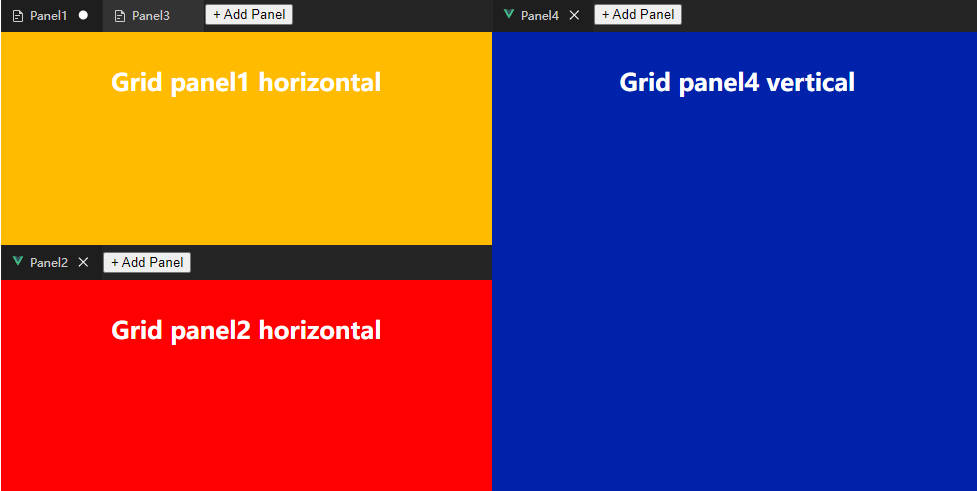
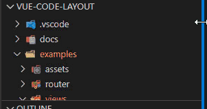

# 介绍

::: info
提示：本组件库不是包装 VScode 原版的代码，而是根据原版的功能重新在Vue上实现的组件，所以功能上可能与原版 VScode 逻辑有所不同。

若本组件库缺少某些实用功能，您可以在 Github 上提出 Issue。
:::

## CodeLayout

CodeLayout 是类似 VScode 最外层的界面布局（不包括中心的编辑器分割布局），
它可以用来搭建你的编辑器外层。

它有四个大板块组成：

* primarySideBar 第一侧边栏，通常在左侧显示，放置最重要的内容.
* secondarySideBar 第二侧边栏，通常在右侧显示。
* bottomPanel 底栏区域。
* centerArea 中心区域，通常在这里显示编辑器区域，这部分内容通过插槽暴露，可以在此插槽中嵌入SplitLayout组件来实现编辑器分割布局。

primarySideBar、secondarySideBar、bottomPanel三个板块的内容均可通过插槽与数据自定义，并且所有内容均可他们之间拖拽、放置。

另外有标题栏区域与状态栏区域一并在组件中实现，这部分内容可通过插槽自定义。

默认布局位置如图示：

CodeLayout还内置了类似 VScode 的 Customize layout 自定义布局的功能，默认在标题栏中点击右上角控制按钮，可以弹出此弹窗。

CodeLayout还支持保存布局数据并在下次加载还原。

[👉 CodeLayout使用方法](./code-layout.md)

## SplitLayout

SplitLayout专用于多个编辑器的分割布局，它支持无限层级面板嵌套和分割，通常可以用于文件编辑器中，需要同时打开编辑多个文件时。
本组件不与CodeLayout耦合，可以拿出来单独使用。

[👉 SplitLayout使用方法](./split-layout.md)

## CodeLayoutScrollbar

CodeLayoutScrollbar是一个Vue的滚动条封装组件，如果你觉得系统内置滚动条与CodeLayout用起来不搭，可以试试使用CodeLayoutScrollbar，它内置了统一的样式。

[👉 CodeLayoutScrollbar参考](../api/CodeLayoutScrollbar.md)
